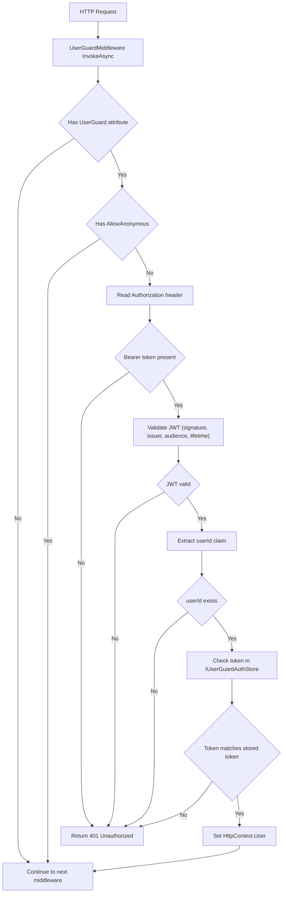

# UserGuard Data Flow

This guard ensures only logged-in users can call endpoints marked with `UserGuard` (except actions marked `AllowAnonymous`).

## Runtime wiring

- `Program` registers guard services: `AddUserGuard(configuration)` and `IUserGuardAuthStore -> AuthUserGuardAuthStore`.
- `Program` adds middleware to pipeline: `app.UseUserGuard()`.
- Controller-level `[UserGuard]` marks endpoints that require authentication.

## Request validation flow

## Data flow details

1. **Route metadata check**: middleware uses endpoint metadata to decide if guard logic is required.
2. **Token extraction**: token is read from `Authorization: Bearer <token>`.
3. **JWT validation**: token is validated using `UserGuardOptions` (`Jwt` section): `Secret`, `Issuer`, `Audience`.
4. **Identity extraction**: middleware reads user id from `sub` or `nameidentifier`.
5. **Stateful token check**: middleware calls `HasMatchingTokenAsync(userId, token)` to ensure the token is still the active token in storage.
6. **Context propagation**: on success, principal is assigned to `HttpContext.User`; request continues to controller action.

## Failure behavior

Any failure in token presence, JWT validation, claim extraction, or store match returns `401 Unauthorized`.
