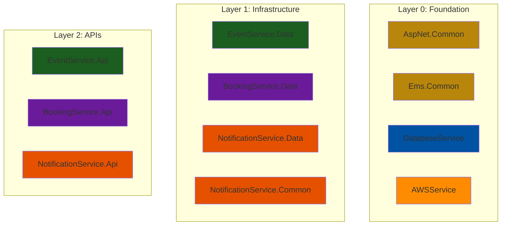

## Event Management System

### Description

This is an on-going project for learning purpose to get an understand on <strong>microservices</strong> and learn to use <strong>C#</strong> with <strong>.NET Core</strong>.

### User Stories

1. As a user, I want to browse upcoming events, so I can find events to attend.
2. As a user, I want to search for events by name, date, or location, so I can quickly find specific events.
3. As a user, I want to view detailed information about an event, so I can decide if I want to attend.
4. As a user, I want to book a spot for event, If there are no spaces anymore, I want to  enroll to a queue and get a spot later, if any
5. As a user, I want to receive notifications about event updates, so I stay informed
6. As an event organizer, I want to create and manage events

### Requirements

- User Authentication: Users must be able to register (we will not implement the registration part, but assume it still needs to be done), log in, and manage their events or attendances.
- Event Catalog: The system must store and manage event details, including name, date, location, description, and availability.
- Search and Filter: Users must be able to search and filter events by various criteria.
- Ticket generation: Users must be able to get a valid ticket to present offline (e.g. QR codes)
- Notifications: Users must receive notifications about event updates.
- Organizer Panel: Event organizers must have access to create and manage events.

### Business Flows

1. Browsing and Searching Events:
    - User navigates to the event management homepage.
    - User browses events by category or uses the search bar to find specific events.
    - System retrieves event data from a database and displays results.
2. Viewing Event Details:
    - User clicks on an event to view its details.
    - System retrieves detailed event information from a database and displays it.
3. Booking a space:
    - User selects an event and enrolls to the attendance
    - System processes the event and creates an a QR code for the user
    - System sends booking confirmation and event updates
4. Enrolling to a queue:
    - If there is no available spaces on an event, a user can enroll to a queue
    - If somebody left the queue, first person from the queue should get a space, and needs to confirm his attendance, otherwise a next person will get the space and so on
5. Managing Events (Organizer):
    - Organizer logs into the organizer panel.
    - Organizer creates, updates, or cancels events.
    - System updates the database with the changes.

### Identify Microservices

- Database service ✅
    - Store data as a single source of truth
- Events service ✅
    - List all events
    - List all events based on profile’s preferences (e.g. language)
    - List my events
    - Search / Filter events by its data
    - Update events
    - Delete events
- Booking service ✅
    - Register for event
    - Cancel registration
    - Queue enrollment
    - Queue confirmation
    - QR code generation
- Notification service ✅
    - Send emails/SMS with specified content and pre-defined templates
- Queue service
    - Get queue length
    - Enqueue
    - Dequeue
    - Triggers notification for next one
- Auth service 
    - Authentication
    - Authorization

### Project Architecture Overview
- Layer 0: Foundation (No Project Dependencies)
- Layer 1: Infrastructure (Depends on Foundation)
- Layer 2: APIs (Depends on both Foundation and Infrastructure)
#### More details in [architecture.md](.docs/architecture.md)

